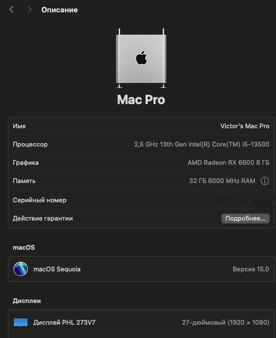

⚠️ **WARNING: You must add your own serial number in `EFI/OC/config.plist`.** Related fields are: `PlatformInfo - Generic - MLB / SystemProductName / SystemSerialNumber / SystemUUID`. You can generate some random numbers by [GenSMBIOS](https://github.com/corpnewt/GenSMBIOS). See [official guide](https://dortania.github.io/OpenCore-Install-Guide/config.plist/comet-lake.html#platforminfo) for details.

## Hardware

- **Motherboard:** MSI MAG B760M MORTAR WIFI II
  - Ethernet: Realtek 2.5Gbps
  - Audio Codec: Realtek ALC897 Codec
  - Wireless (Bluetooth): Intel Wi-Fi 6E
- **CPU:** Intel Core i5 13500 (iGPU not working in MacOs)
- **dGPU:** Sapphire AMD RX 6600 PULSE
- **Storage:**  Adata Legend 850 512GB
- **RAM:** Adata DDR5 6400 16GB*2 (only 6000)

## Software

- **OS:** macOS Sequoia 15.0
- **Bootloader:** OpenCore 1.0.1

## What's working

- [x] OpenCore GUI Picker
- [x] dGPU
- [x] Restart / Shutdown
- [x] Sleep / Wake
- [x] WiFi  / with HeliPort and Itlwm
- [X] Bluetooth (testing)
- [x] USB
- [x] macOS & Windows 11

## BIOS Settings

MSI MAG B760M MORTAR WIFI II AMI BIOS ver 7E13v17 build 2024-08-30

SETTINGS - Advanced:
 - PCIe/PCI Sub-system Settings - Re-size BAR Support: Disabled
 - Integrated Peripherals - External SATA Controller Mode: AHCI Mode
 - Integrated Graphics Configuration
   - Initiate Graphic Adapter: PEG
   - IGD Multi-Monitor: Enabled
- USB Configuration - XHCI Hand-off: Enabled
- BIOS CSM/UEFI Mode: UEFI

SETTINGS - Boot:
- MSI Fast Boot: Disabled
- Fast Boot: Disabled

SETTINGS - Security - Secure Boot - Secure Boot: Disabled

OC - CPU Features:
- Intel Virtualization Tech (VT-x): Enabled
- Intel VT-D Tech: Disabled
- CFG Lock: Disabled

## Kexts
| Name                                                                                                                                                                                                          | Version            |      |
|---------------------------------------------------------------------------------------------------------------------------------------------------------------------------------------------------------------|--------------------| ---- |
| [Lilu](https://github.com/acidanthera/Lilu/releases)                                                                                                                                                          | 1.6.8              |      |
| [VirtualSMC](https://github.com/acidanthera/VirtualSMC/releases)  SMCProcessor   SMCSuperIO                                                                                                         | 1.3.3              |      |
| [SMCRadeonSensors](https://github.com/NootInc/RadeonSensor/releases)                                                                                                                                          | 2.2.0              |      |
| [WhateverGreen](https://github.com/acidanthera/WhateverGreen/releases)                                                                                                                                        | 1.6.7              |      |
| [AppleALC](https://github.com/acidanthera/AppleALC/releases)                                                                                                                                                  | 1.9.1              |      |
| [NVMeFix](https://github.com/acidanthera/NVMeFix/releases)                                                                                                                                                    | 1.1.1              |      |
| [CPUFriend](https://github.com/acidanthera/CPUFriend/releases/)                                                                                                                                               | 1.2.8              | not loaded     |
| [CPUFriendDataProvider]()                                                                                                                                                                                     | 1.0.0              | not loaded     |
| [CpuTopologyRebuild](https://github.com/b00t0x/CpuTopologyRebuild)                                                                                                                                            | 1.1.0              |      |
| [RestrictEvents](https://github.com/acidanthera/RestrictEvents)                                                                                                                                               | 1.1.4              |      |
| [LucyRTL8125Ethernet](https://www.insanelymac.com/forum/files/file/1004-lucyrtl8125ethernet/)                                                                                                                 | 1.1.0              |      |
| [USBInjectAll]()                                                                                                                                                                                              | 0.8.0              | not loaded     |
| [USBPorts]()                                                                                                                                                                                                  | 1.0.0              | usb on motherboard |
| [AirportItlwm](https://github.com/OpenIntelWireless/itlwm/releases)                                                                                                                                           | 2.3.0 Sonoma 14.4+ |      |
| [itlwm](https://github.com/OpenIntelWireless/itlwm/releases)                                                                                                                                                  | 2.3.0              |      |
| [BlueToolFixup](https://github.com/acidanthera/BrcmPatchRAM/releases) | 2.6.9              |      |
| [IntelBluetoothFirmware](https://github.com/OpenIntelWireless/IntelBluetoothFirmware/releases)  IntelBTPatcher                                                                                           | 2.5.0              |      |

## Config

Most of efi configurations are based on [Dortania's guide for Comet Lake](https://dortania.github.io/OpenCore-Install-Guide/config.plist/comet-lake.html#acpi), but there are some differences for 13th CPU (thanks [大头蔡Cass](https://www.youtube.com/watch?v=qcOpeg9E1fQ)).

- CPU's SSDT is `SSDT-PLUG-ALT.aml` provided with opencore pkg.
- Kernel-Emulate: Emulate Comet Lake, details:
  - Cpuid1Data: `55060A00000000000000000000000000`
  - Cpuid1Mask: `FFFFFFFF000000000000000000000000`
- Kernel-Quirks: enable `provideCurrentCpulnfo`
- NVRAM-Add-4D1FDA02...: add new item `revcpu` with value 1 (number)
- NVRAM-Del-4D1FDA02...: add item `revcpu`
- PlatformInfo-Generic-ProcessorType: `3841` (need `RestrictEvents.kext`)

# Bluetooth (testing) 
[link2](https://forum.amd-osx.com/threads/finally-intel-bluetooth-working-under-sequoia-15-0-24a335.5430/)
[link3](https://github.com/OpenIntelWireless/IntelBluetoothFirmware/issues/486)

[IntelBluetoothFirmware.kext 2.5.0](https://forum.amd-osx.com/threads/finally-intel-bluetooth-working-under-sequoia-15-0-24a335.5430/post-36917)  
[IntelBTPatcher.kext 2.5.0 pre-release one](https://github.com/OpenIntelWireless/IntelBluetoothFirmware/issues/486#issuecomment-2357211572)

[BlueToolFixup.kext](https://dortania.github.io/builds/?product=BrcmPatchRAM&viewall=true&version=2.6.9&sha=d7e3f23c374c7048bc31a207da3d1804f593f47b)  

In config.plist added the following NVRAM entries link3 

      NVRAM > Add > 'New child under 7C436110-AB2A-4BBB-A880-FE41995C9F82'
          bluetoothExternalDongleFailed — Data — 00
          bluetoothInternalControllerInfo — Data — 00000000 00000000 00000000 0000
      NVRAM > Delete > 'New child under 7C436110-AB2A-4BBB-A880-FE41995C9F82'
          bluetoothExternalDongleFailed
          bluetoothInternalControllerInfo

## Mount EFI Partition on macOS Sequoia and Later

1. diskutil list
2. sudo mkdir /Volumes/efi
3. sudo mount -t msdos /dev/diskXsY /Volumes/efi
4. sudo diskutil unmount /dev/diskXsY

## Based on repository: [oc-b760m-13700-6800](https://github.com/ichenhe/oc-b760m-13700-6800)